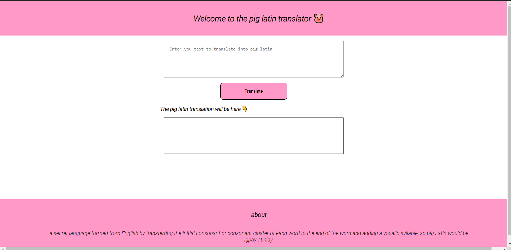

# **Pig Latin Translator App**
This is a pig latin translator. Pig Latin, or "Igpay Atinlay" is a language game or argot in which English words are altered, usually by adding a fabricated suffix or by moving the onset or initial consonant or consonant cluster of a word to the end of the word and adding a vocalic syllable to create such a suffix.

---

## **Interface of the app**

---
## **How to use the app**

1. This app asks user for input, anything they want to say.
2. Click on the Transalate button to get the pig latin translation.

---
## **Built using:**
1. HTML 
2. CSS 
3. Javascript.
4. Fun Translation Api.

## **Link of the app.**

[Pig Latin Translator](https://rohitpiglatin.netlify.app/)